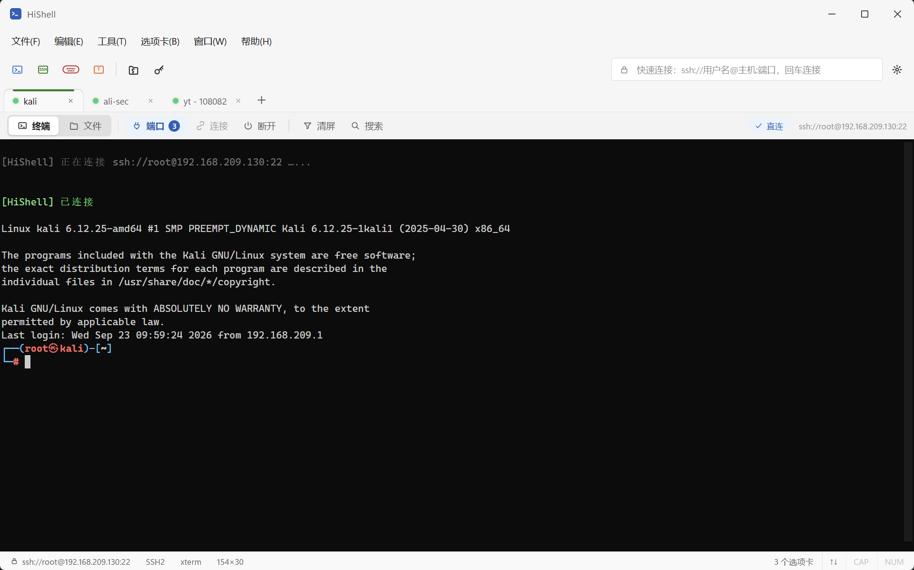
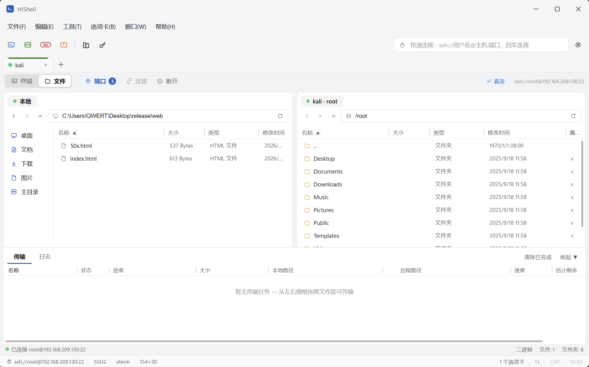
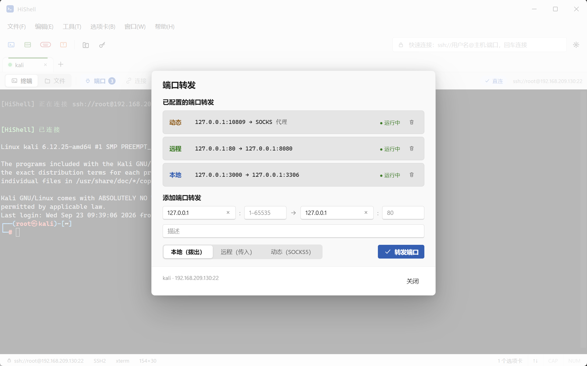
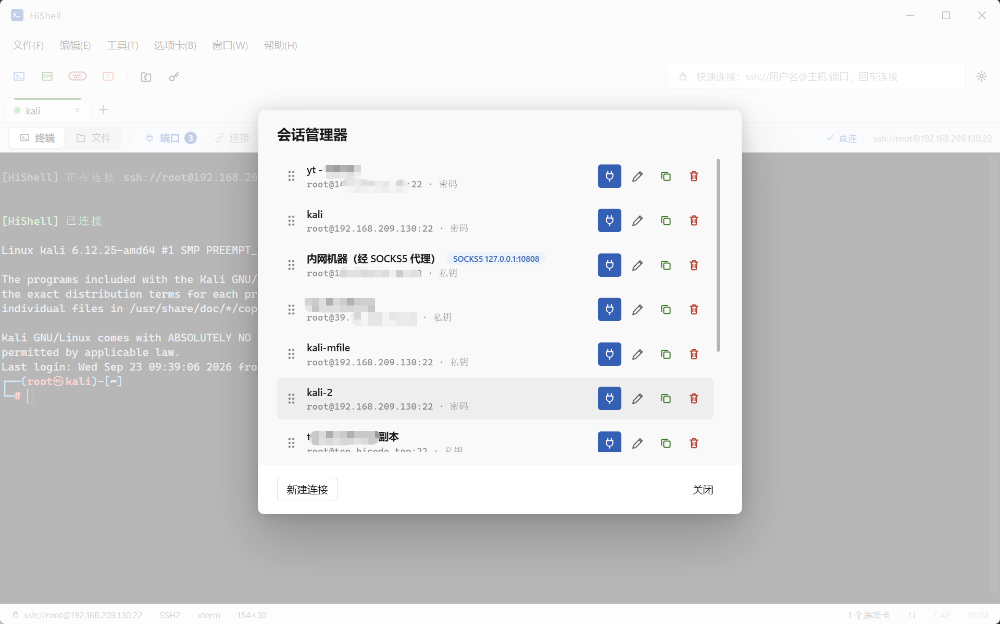
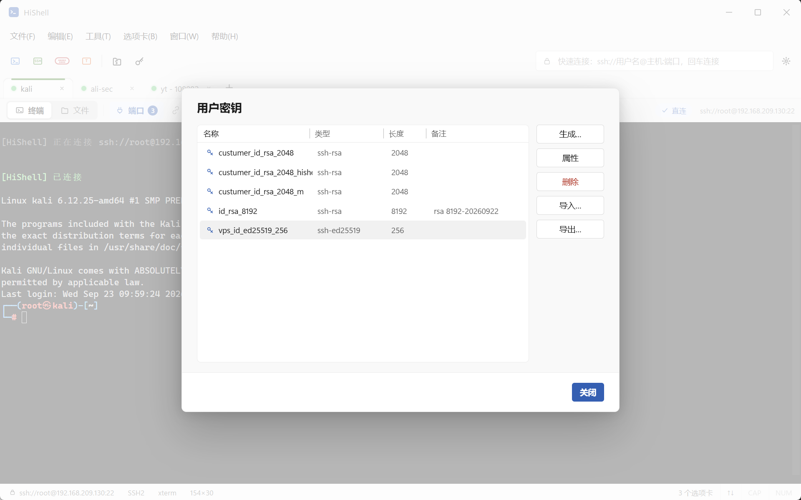
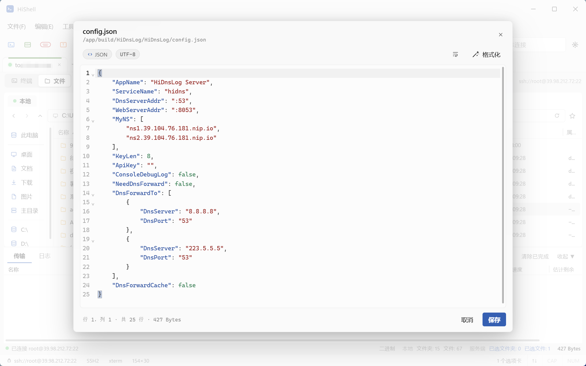
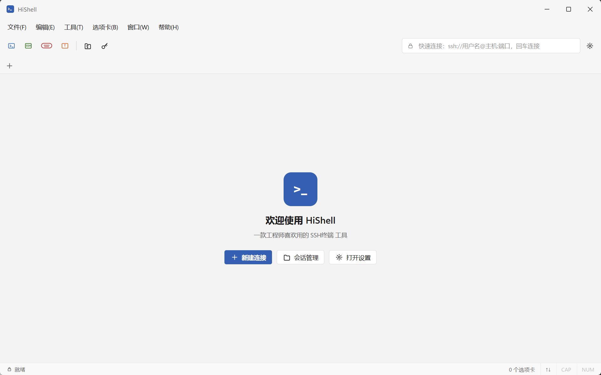

# HiShell

**一款工程师爱用的 SSH 终端工具**

跨平台工具，对标 Xshell / Xftp / Tabby

支持 Windows 10+、Mac os、Linux 桌面运行

---

## ✨ 功能特性

- 支持**多标签 SSH 终端**、**SFTP文件管理**
- 支持生成RSA、ECDSA、ED25519格式密钥，支持**导入**和**导出**密钥。（并且支持导出为PuTTY ppk格式）
- 认证方式支持主机 密码、私钥、用户密钥、Keyboard-interactive、Agent
- 支持多种SSH隧道，支持 **本地（拨出）**/ **远程（传入）**/ **动态（SOCKS5）** 端口转发
- UI支持国际化语言（当前支持 简体中文 / English）
- 完美替代 XShell 和 Tabby 等常用 SSH 终端

## 📸 界面预览

| |
|---|
| *多标签 SSH 终端（端口转发徽标 / 搜索 / 状态栏）* | 
|  |
| *SFTP 双栏 + 传输队列（进度 / 速度 / 剩余时间）* |
|  |
| *端口转发（本地 / 远程 / 动态 SOCKS5）* |
|  |
 | *会话管理器（拖拽排序 / 复制 / 连接）* |
|  |
| *用户密钥管理器（生成 / 导入 / 导出）* |
|  |
| *在线编辑文件（支持语法高亮）* |
|  |
 | *欢迎主页* |
|  |

## 💬 关于作者

- 👨‍💻 昵称：**犀利的远哥**
- ✉️ 微信：`hicode0101`

遇到问题请随时联系我，我会及时回复；对工具功能有新的想法和需求，也请告知我，我非常乐意尝试满足。

| 📱 我的微信 |
|:---:|
|  |

---

**HiTools** ✦ Made with ❤️ by [hicode0101](https://github.com/hicode0101)

